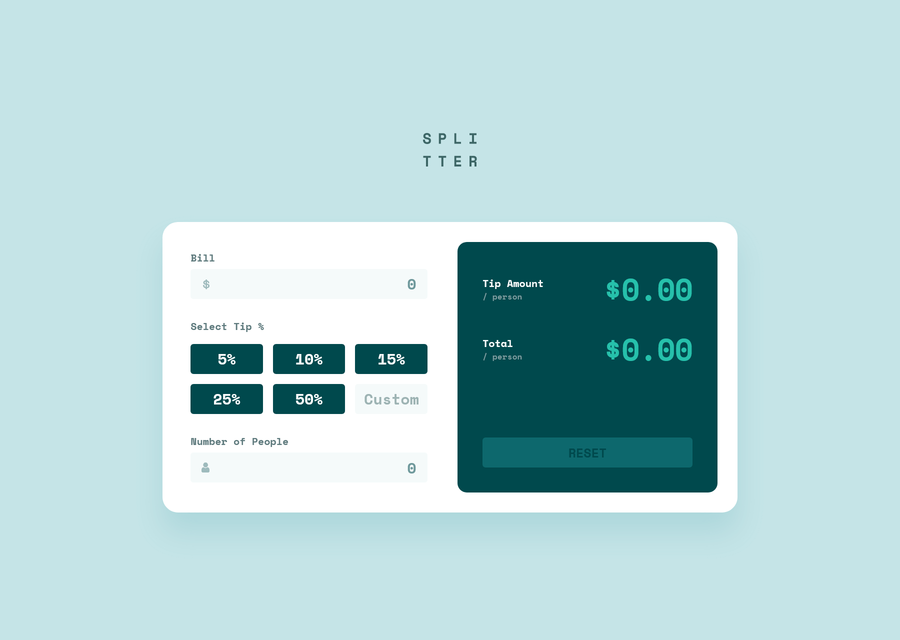
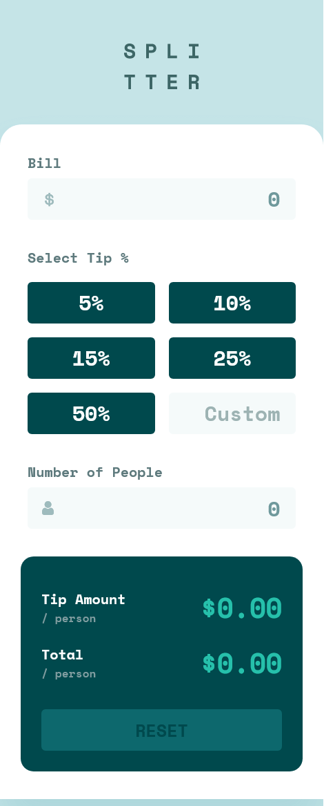

# Frontend Mentor - Tip calculator app solution

This is a solution to the [Tip calculator app challenge on Frontend Mentor](https://www.frontendmentor.io/challenges/tip-calculator-app-ugJNGbJUX). Frontend Mentor challenges help you improve your coding skills by building realistic projects.

## Table of contents

- [Overview](#overview)
  - [The challenge](#the-challenge)
  - [Screenshots](#screenshots)
  - [Links](#links)
- [My process](#my-process)
  - [Built with](#built-with)
  - [What I learned](#what-i-learned)
- [Author](#author)

## Overview

### The challenge

Users should be able to:

- View the optimal layout for the app depending on their device's screen size
- See hover states for all interactive elements on the page
- Calculate the correct tip and total cost of the bill per person

### Screenshots

Desktop

---

Mobile

### Links

- Solution URL: [https://github.com/mihalymarcell86/tip-calculator-app](https://github.com/mihalymarcell86/tip-calculator-app)
- Live Site URL: [https://tip-calculator-iwbcy3nao-mihalymarcell86.vercel.app/](https://tip-calculator-iwbcy3nao-mihalymarcell86.vercel.app/)

## My process

### Built with

- Semantic HTML5 markup
- Sass, BEM
- Mobile-first workflow
- [React](https://reactjs.org/) - JS library

### What I learned

First I used radio buttons to create the tip selectors, so that I can style them with the appropriate CSS pseudo classes.
I learned that, in terms of accessibility, this solution raised some problems. `tabindex` walks through the radio buttons, however if they are hidden, it doesn't highlight the labels. Even after defining `tabindex` on them, they cannot be selected with the keyboard, unless adding an event listener.
I decided to replace the radio buttons with divs and use conditional classes for the styling instead and assigning `role` attributes to

I ran into some problems with absolutely positioning the icons within the input field. Originally the fields were wrapped in a `fieldset`, and the titles were given as `legend`,
but it turned out that different browsers would calculate the coordinates within these elements differently, so I had to change them into `div`s.

## Author

Marcell Mihály

- GitHub - [mihalymarcell86](https://github.com/mihalymarcell86)
- Frontend Mentor - [@mihalymarcell86](https://www.frontendmentor.io/profile/mihalymarcell86)
